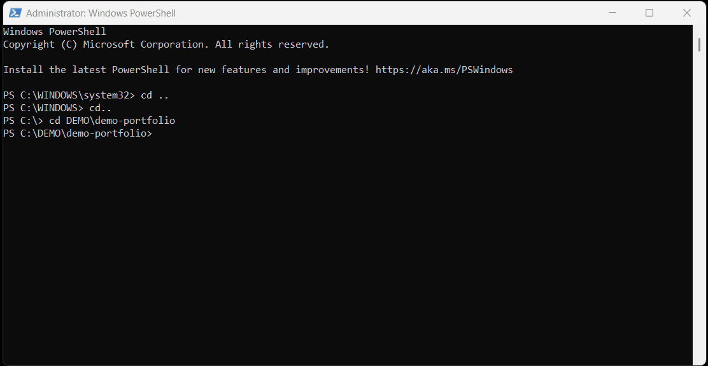
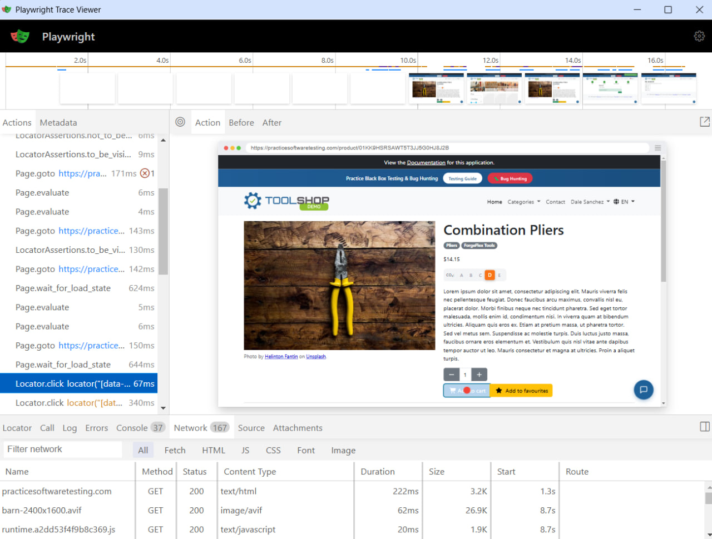

# Hybrid Test Automation Portfolio

[](https://github.com/maderkabest/automation-portfolio-demo/actions/workflows/ci.yml)
[](https://www.python.org/)
[](https://playwright.dev/python/)
[](https://github.com/astral-sh/ruff)
[](https://mypy-lang.org/)
[](https://www.docker.com/)

## Test Execution Demo

<div align="center">
  
  <p><i>Full test suite run: API · Hybrid · UI · Integration layers</i></p>
</div>

## Key Architectural Benefits

This framework solves a common CI/CD bottleneck: slow releases caused by heavy UI test suites. By applying a true Testing Pyramid, it focuses on speeding up developer feedback loops, cutting CI resource costs, and building stable, reliable tests.

- **API layer** provides instant feedback on core business logic, catching bugs early without the overhead of browser rendering
- **UI layer** focuses strictly on critical user journeys, reducing test flakiness and minimizing maintenance efforts
- **Hybrid layer** accelerates execution by using APIs for test setup, saving 10-15s per test and drastically speeding up the overall pipeline
- **Integration layer** ensures data integrity directly in PostgreSQL, catching backend state issues before they manifest in the UI
- **CI pipeline** runs in parallel for speed and handles real-world infrastructure constraints (like Cloudflare WAFs) gracefully, preventing false-positive test failures

## 🛠 Tech Stack

| Category       | Tool                            |
|----------------|---------------------------------|
| Core           | Python 3.12 + pytest            |
| Web Automation | Playwright (Sync API)           |
| API Testing    | Requests + Pydantic v2          |
| Database       | PostgreSQL + psycopg2           |
| Code Quality   | Ruff (lint) · Mypy (typing)     |
| CI/CD          | GitHub Actions                  |
| Reporting      | Playwright Trace Viewer, Allure |

## Implementation Highlights

## Test Architecture

| Layer | Directory | Implementation Highlights |
|---|---|---|
| API | `tests/api/` | REST validation via Pydantic, strict schema checks, automated auth flows |
| UI | `tests/ui/` | Page Object Model (POM), resilient Playwright locators tailored for Angular SPA |
| Hybrid | `tests/hybrid/` | API user setup + UI login flow; JWT injection via `localStorage` to bypass login for E2E checkout |
| Integration | `tests/integration/` | Direct PostgreSQL queries via `psycopg2` for backend state verification |

<div align="center">
  
  <p><i>Framework architecture: how API, UI, Hybrid and Integration layers interact</i></p>
</div>

## How to Run

**Prerequisites:** Python 3.12+, Docker Desktop

```bash
# 1. Clone repository and install dependencies
git clone https://github.com/maderkabest/automation-portfolio-demo.git
cd automation-portfolio-demo
pip install -r requirements.txt
playwright install chromium

# 2. Configure environment variables
cp .env.example .env
# Edit .env with your values

# 3. Run API layer (Fastest feedback loop, no Docker required)
pytest tests/api/ -v

# 4. Spin up local database and run Integration tests
docker compose -f docker/docker-compose.yml --env-file .env up -d
pytest tests/integration/ -v

# 5. Run UI and Hybrid layers (Browser execution)
pytest tests/ui/ tests/hybrid/ -v
```

## 🛡️ CI/CD Resilience & Infrastructure Constraints

The UI and Hybrid test suites (tests/ui/, tests/hybrid/) run flawlessly on local machines. However, in real-world CI/CD environments like GitHub Actions, the target demo website (practicesoftwaretesting.com) actively blocks datacenter IPs via Cloudflare WAF (returning HTTP 403 + cf-mitigated: challenge).

How this framework handles it (Graceful Degradation):
Instead of allowing the pipeline to fail blindly and block deployments, I implemented a resilient CI strategy:

A pre-check step proactively detects Cloudflare blocking.

If a block is detected, the pipeline gracefully skips UI execution and posts a summary message explaining the environment constraint.

API and Integration tests continue to run and pass normally, ensuring developers still get critical feedback on the backend and database layers.

**How this is handled in this project:**

- The CI pipeline includes a pre-check step that detects Cloudflare blocking
- If a block is detected, the pipeline gracefully skips UI test execution
- A summary message is posted to the Workflow Summary explaining the limitation
- API and Integration tests continue to run and pass normally

To run the full E2E suite, execute the tests locally following the setup instructions above.

#### 🔎 Faster Root Cause Analysis (Playwright Trace Viewer)

Every UI and Hybrid test run automatically captures a full execution trace, including screenshots, DOM snapshots, and network activity. This significantly speeds up Root Cause Analysis (RCA) by allowing developers to debug issues offline without needing to re-run the pipeline.

```bash
playwright show-trace test-results/trace.zip
```

<div align="center">
  
  <p><i>Playwright Trace Viewer: Full execution trace with DOM snapshots and network activity</i></p>
</div>
